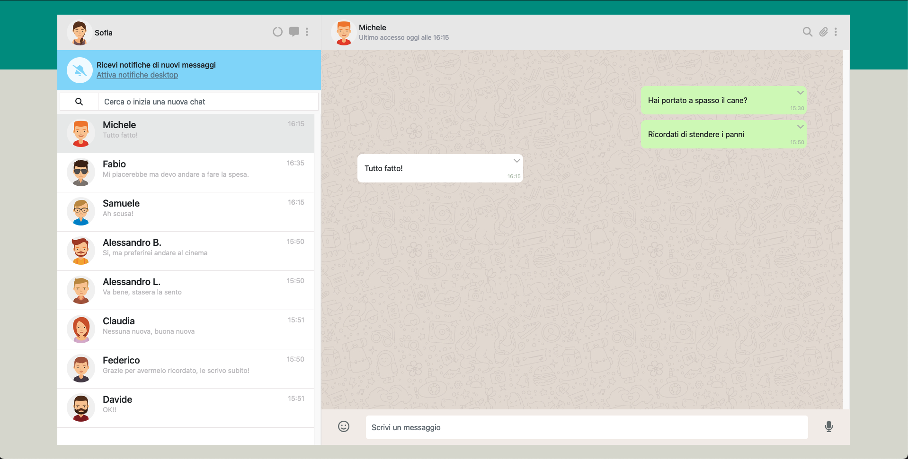
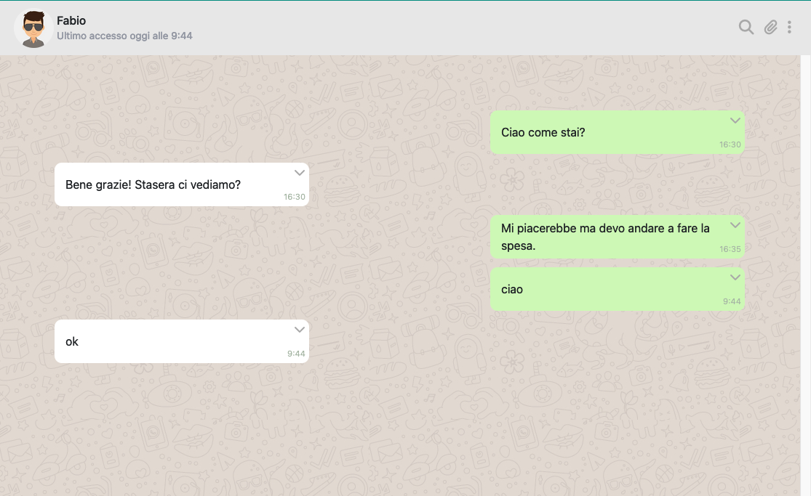
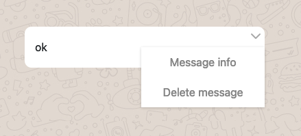
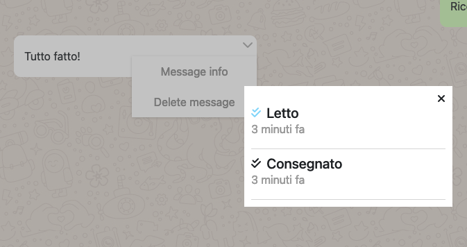

# vue-boolzapp
A whatsapp replica made in Vue JS

<h2><strong>HOW IT WORKS:</strong></h2>
This webapp it's a replica of a Whatsapp web page.
It contains different chats with different peoples. inside every chat there are the older conversations with also the contact and the messages informations. 
The user can send messages in the chat and he will recieve an Ok as a reply from the bot. 
The user can also search a chat writing the name of the chat user in the searchbar.   

   

Pressing on the arrow in top-right message, there will be avaiable a new menu, in wich we could decide of deleting the message or to get some message infos (what time it was sent and if it was read).
  
  
<h3><strong>Have fun!</strong></h3>
